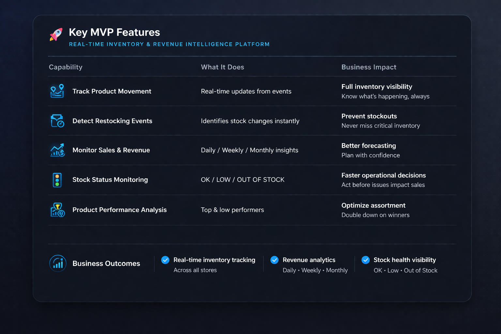
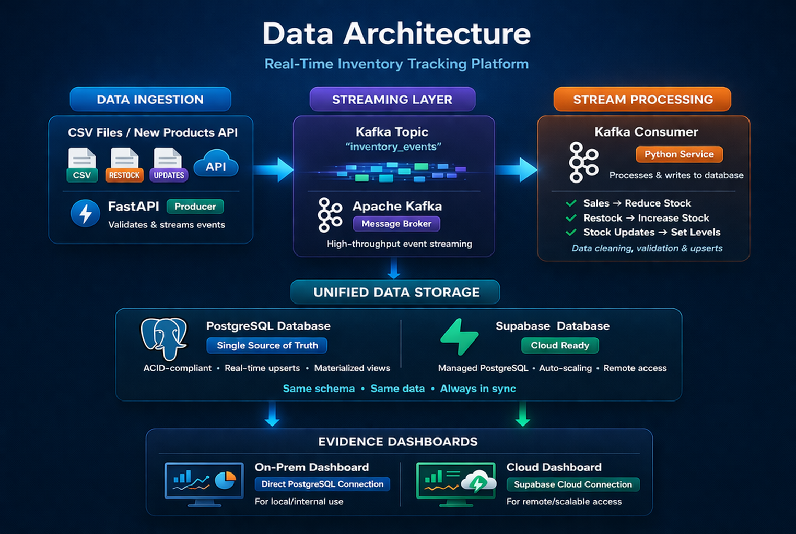
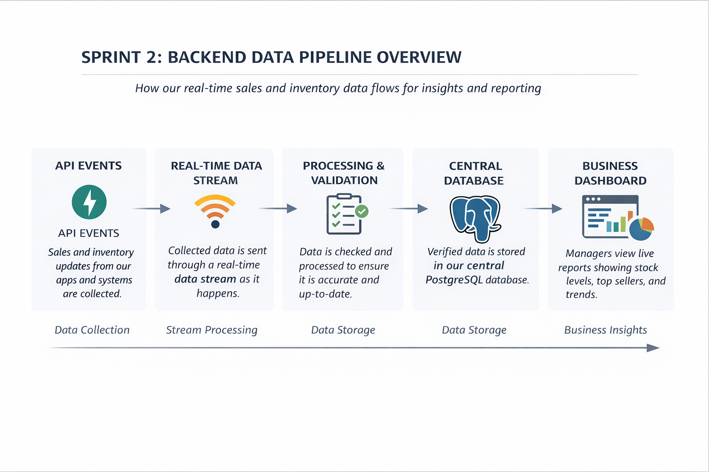
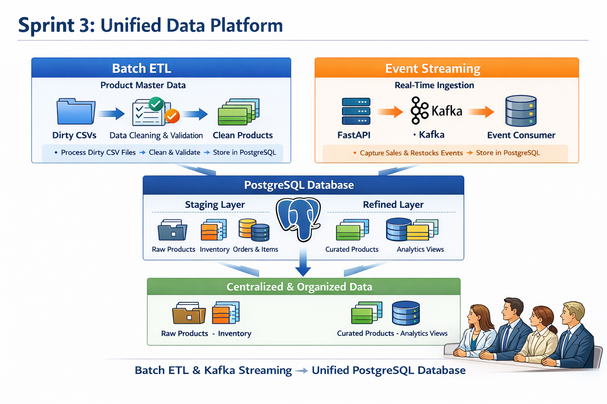
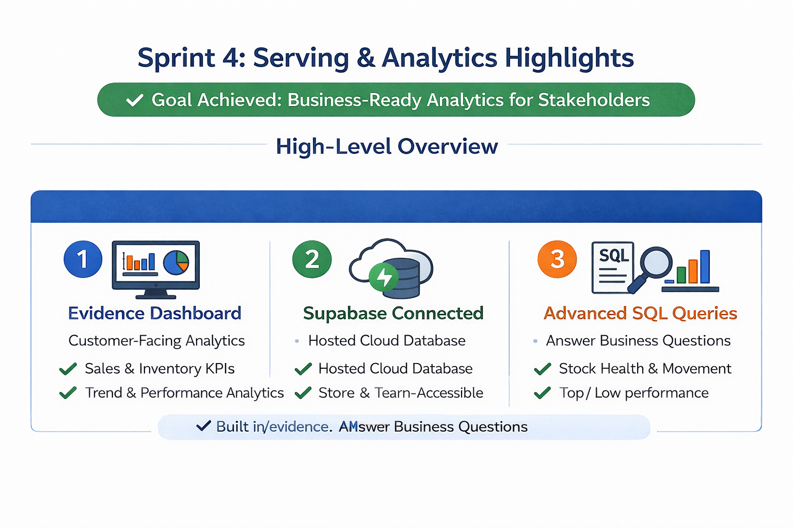

# About our Product: Product_Finder
**Product_Finder is an inventory management platform prototype for a retail company (SportsWear AB). Our platform brings together sales and inventory data so businesses can clearly see what’s happening in their operations. This enables them to avoid costly mistakes, optimize stock levels, and make confident decisions based on real data.**

## Project Overview
This system captures real-time inventory events, such as **sales**, **inventory events updates** and **restocks**. It stores them durably in a PostgreSQL database. Events are produced by a FastAPI application, transmitted through an Apache Kafka topic (`inventory_events`), and consumed by a dedicated database consumer that persists each event. A base dataset of products, stores, categories, and other reference data is pre-loaded from CSV files into the database at startup.

---

## Full Runbook
This guide is the **full end-to-end flow** for a new person opening the project for the first time.
- [Full Runbook](documentation/full_runbook.md)


## Repository Setup
- [Repository Setup](documentation/kafka_and_etl/setup.md)
- [Spin up Docker Container with Host Services](documentation/kafka_and_etl/connect_docker_psql_kafka.md)
- [Connecting events pipeline](documentation/kafka_and_etl/events_pipeline_guide.md)

## Repository Structure
```
Product_Finder/
├── README.md                           # Main overview, architecture, and links
├── docker-compose.yml                  # Starts the full platform stack
├── pyproject.toml                      # Python dependencies and project config
│
├── app/
│   ├── main.py                         # FastAPI API that sends events to Kafka
│   ├── consumer/
│   │   └── db_consumer.py              # Kafka consumer that writes events to PostgreSQL
│   └── schema/
│       └── product.py                  # Validation/data models for products and events
│
├── scripts/
│   ├── transform.py                    # ETL cleaning/validation step
│   ├── load_products.py                # Loads cleaned product data into PostgreSQL
│   ├── generate_clean_csv.py           # Creates valid mock CSV data
│   ├── generate_dirty_csv.py           # Creates invalid test CSV data
│   └── generate_sales_csv.py           # Creates mock sales CSV data
│
├── sql/
│   ├── init.sql                        # Initializes database schema
│   └── user_story_queries.sql          # Example business/analytics queries
│
├── evidence_app/
│   ├── package.json                    # Evidence dashboard app config
│   ├── pages/                          # Dashboard pages
│   └── sources/                        # SQL/data sources used by dashboards
│
├── documentation/
│   ├── MVP.md                          # MVP and user stories
│   ├── kafka_and_etl/                  # Setup + pipeline documentation
│   └── test/                           # Manual/system test documentation
│
└── assets/                             # Images used in README/docs
```

---

## User Stories for Business
[Minimum Viable Product and User Stories](documentation/MVP.md)


## User Stories for Developers


## Business Value


---

## Architecture

```
                    ┌──────────────────────────────────────────────┐
                    │ Dockerized Environment (End-to-End Platform) │
                    │ All services run inside containers           │
                    └──────────────────────────────────────────────┘


                    ┌──────────────────────────────┐
                    │ Synthetic / Seed Data        │
                    │ data/raw/*.csv               │
                    └──────────────┬───────────────┘
                                   │
                                   ▼
                    ┌──────────────────────────────┐
                    │ Batch ETL                    │
                    │ scripts/transform.py         │
                    │ -> products_clean.csv        │
                    │ -> products_rejected.csv     │
                    └──────────────┬───────────────┘
                                   │
                                   ▼
┌──────────────┐      ┌──────────────────────────────┐      ┌────────────────────┐
│ HTTP Clients │ ───► │ FastAPI producer             │ ───► │ Kafka topic        │
│ Postman etc. │      │ app/main.py                  │      │ inventory_events   │
└──────────────┘      └──────────────────────────────┘      └─────────┬──────────┘
                                                                       │
                                                                       ▼
                                                        ┌────────────────────────┐
                                                        │ Kafka consumer         │
                                                        │ app/consumer/          │
                                                        │ db_consumer.py         │
                                                        └────────────┬───────────┘
                                                                     │
                                                                     ▼
            ┌───────────────────────────────────────────────────────────┐
            │ PostgreSQL (Containerized) (BEFORE)                       │
            │ Supabase PostgreSQL (Hosted) (AFTER)                      │
            │ staging schema + refined materialized views               │
            │ analytics queries                                         │
            └──────────────┬────────────────────────────────────────────┘
                           │
                           ▼
            ┌────────────────────────────────────────────────────────────┐
            │ Analytics / Dashboard Layer (Inside Docker)  (BEFORE)      │
            │ Evidence dashboards                                        │ 
            │ Analytics / Dashboard Layer (Evidence local app)           │
            │ Evidence dashboards (connected to Supabase) (AFTER)        │                                      
            │ Business KPIs & query results                              │
            │ → Final interface used by customers for decision-making    │
            └────────────────────────────────────────────────────────────┘
```



| Component                          | Technology                                                                | Purpose                                                                                              |
| ---------------------------------- | ------------------------------------------------------------------------- | ---------------------------------------------------------------------------------------------------- |
| **Docker Compose**                 | `docker-compose.yml`                                                      | Orchestrates the full platform (PostgreSQL, Kafka, Evidence dashboard) in a reproducible environment |
| **PostgreSQL**                     | `postgres:16-alpine`                                                      | Central data store for inventory, events, and analytical queries                                     |
| **Supabase PostgreSQL**            | Hosted PostgreSQL (`supabase/sql/*` migrations)                           | Central data store for inventory, events, refined views, and analytics                               |
| **Apache Kafka**                   | `apache/kafka:latest`                                                     | Real-time event streaming via the `inventory_events` topic                                           |
| **init.sql**                       | SQL DDL script                                                            | Initializes `staging` and `refined` schemas and prepares database structure                          |
| **CSV Seed Data**                  | `data/raw|processed/*.csv`                                                | Base reference datasets (products, stores, brands, etc.) used for initial loading                    |
| **Data Generators**                | `generate_clean_csv.py`, `generate_dirty_csv.py`, `generate_sales_csv.py` | Simulate realistic and edge-case data scenarios for testing pipeline robustness                      |
| **Transformation Layer (ETL)**     | `scripts/transform.py`                                                    | Cleans, validates, and splits raw data into `clean` and `rejected` datasets                          |
| **Batch Load Script**              | `load_products.py`                                                        | Loads cleaned data into PostgreSQL (primarily for testing and ETL validation)                        |
| **Data Schema / Validation Model** | `app/schema/product.py`                                                   | Defines product structure and enforces data validation rules across the pipeline                     |
| **FastAPI Producer**               | `app/main.py`                                                             | API layer that receives business events and publishes them to Kafka                                  |
| **Kafka Consumer**                 | `app/consumer/db_consumer.py`                                             | Processes streaming events and persists them into PostgreSQL                                         |
| **Analytics Dashboard**            | Evidence (Docker)                                                         | Presents KPIs and query results as dashboards for business users                                     |
| **Analytics Dashboard**            | Evidence (`evidence_app/`, local `npm run dev`)                           | Presents KPIs and query results as dashboards for business users                                     |


## 📊 Data Model

[Data Model Relationship Description](documentation/data_model/relationship_desc.md)

---

## Data Flow Diagram

```
CSV files ──────────────────────────────► PostgreSQL / Supabase (staging schema)
(data/raw|processed/*.csv)                (reference tables: products,
                                           stores, brands, categories…)

 │
                                                     ▼
                                        refined.refresh_refined() batch load
                                                     │
                                                     ▼
                                    PostgreSQL / Supabase (refined schema for analytics)                                           

HTTP Client          FastAPI              Kafka               PostgreSQL / Supabase
(Thunder Client) ──► app/main.py ──────► inventory_events ──► db_consumer.py ──► staging.orders  ──► refined.orders
POST /api/sales       (producer)          (topic)             (consumer)          staging.items      refined.items
```

---

## Other Documentations
- [Run Supabase](documentation/test/05_evidence_build.md)
- [Validation Summary](documentation/kafka_and_etl/validations.md)
- [Database Schema](documentation/kafka_and_etl/schema.md)
- [Test 1: Event Endpoints](documentation/test/01_test_event_endpoint.md)
- [Test 2: New Product Feature](documentation/test/02_test_newproduct.md)
- [Test 3: Full Pipeline](documentation/test/03_test_full_pipeline.md)
- [Test 4: Dirty Mock Data Transformation](documentation/test/04_dirty_data_manual_test.md)


## Sprint Documentations
- [Sprint_2](documentation/kafka_and_etl/sprint2.md)



- [Sprint_3](documentation/kafka_and_etl/sprint3.md)



- [Sprint_4](documentation/kafka_and_etl/sprint4.md)


