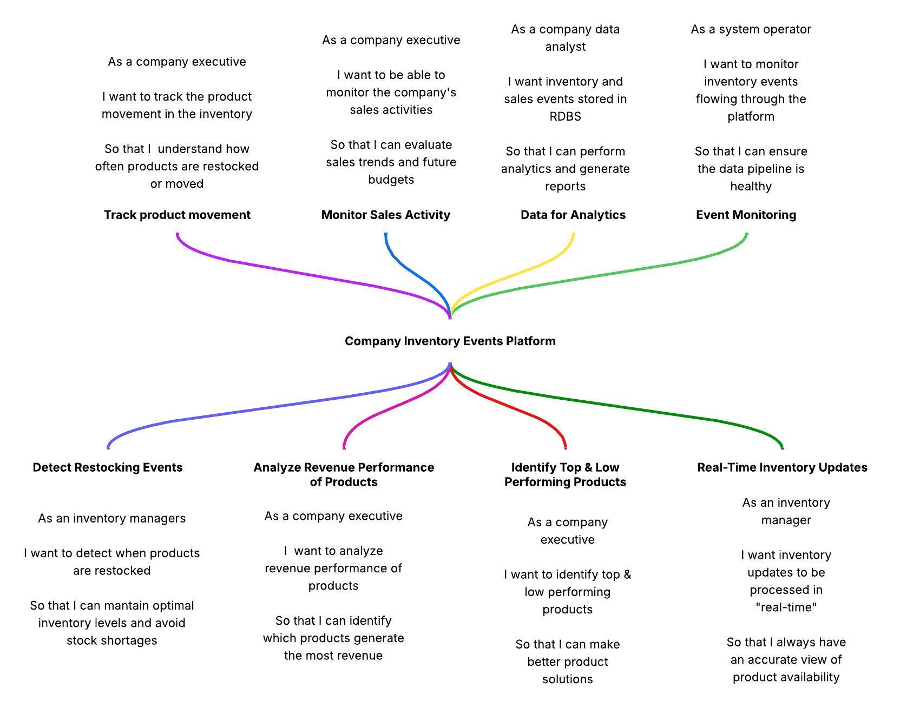
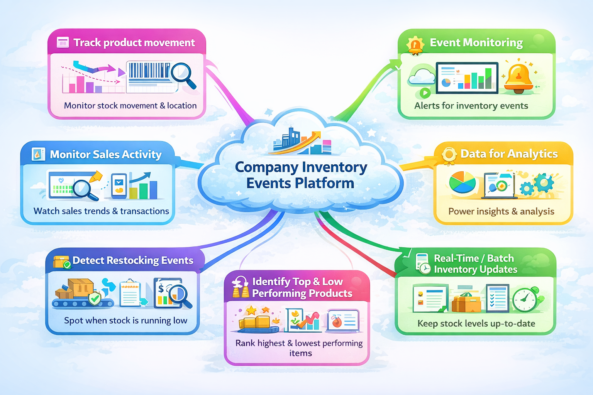
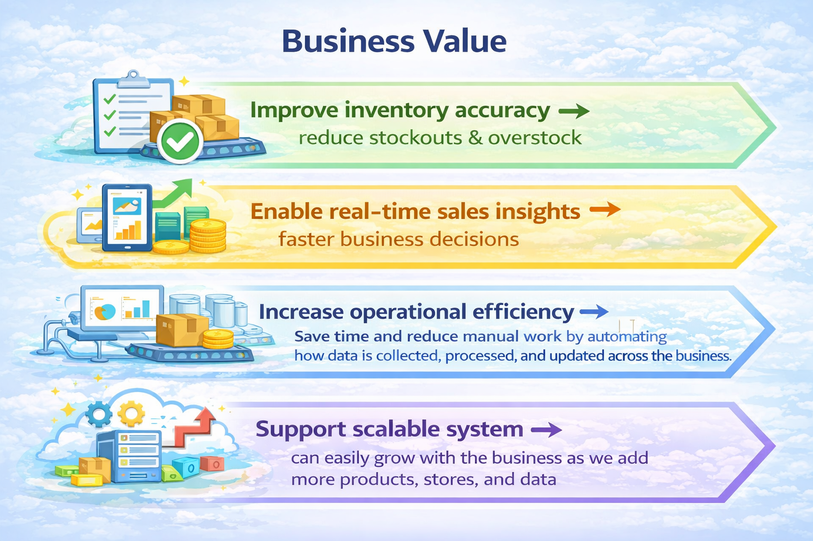
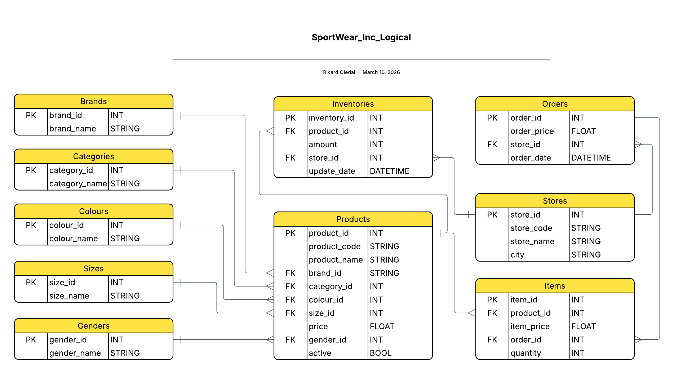

# Product_Finder
**Product_Finder is an inventory intelligence platform prototype for a retail company. Our platform brings together sales and inventory data so businesses can clearly see what’s happening in their operations. This enables them to avoid costly mistakes, optimize stock levels, and make confident decisions based on real data.**

## Project Overview
This system captures real-time inventory events — such as **sales**, **inventory events updates** and **restocks**. It stores them durably in a PostgreSQL database. Events are produced by a FastAPI application, transmitted through an Apache Kafka topic (`inventory_events`), and consumed by a dedicated database consumer that persists each event. A base dataset of products, stores, categories, and other reference data is pre-loaded from CSV files into the database at startup.

---

## Repository Setup
[Repository Setup](documentation/kafka_and_etl/setup.md)
[Spin up Docker Container with Host Services](documentation/kafka_and_etl/connect_docker_psql_kafka.md)
[Connecting events pipeline](documentation/kafka_and_etl/events_pipeline_guide.md)

---

## User Stories

- a **batch ETL layer** that cleans synthetic product master data,
- a **streaming/event layer** built with **FastAPI + Kafka**,
- a **PostgreSQL warehouse-style database** with `staging` and `refined` schemas, and a set of **SQL queries** intended to power analytics, reporting, and future dashboards.


[Minimum Viable Product and User Stories](documentation/kafka_and_etl/MVP.md)


## Business Value



---

## Architecture

```
                    ┌──────────────────────────────────────────────┐
                    │ Dockerized Environment (End-to-End Platform) │
                    │ All services run inside containers           │
                    └──────────────────────────────────────────────┘


                    ┌──────────────────────────────┐
                    │ Synthetic / Seed Data        │
                    │ data/raw/*.csv               │
                    └──────────────┬───────────────┘
                                   │
                                   ▼
                    ┌──────────────────────────────┐
                    │ Batch ETL                    │
                    │ scripts/transform.py         │
                    │ -> products_clean.csv        │
                    │ -> products_rejected.csv     │
                    └──────────────┬───────────────┘
                                   │
                                   ▼
┌──────────────┐      ┌──────────────────────────────┐      ┌────────────────────┐
│ HTTP Clients │ ───► │ FastAPI producer             │ ───► │ Kafka topic         │
│ Postman etc. │      │ app/main.py                  │      │ inventory_events    │
└──────────────┘      └──────────────────────────────┘      └─────────┬──────────┘
                                                                       │
                                                                       ▼
                                                        ┌────────────────────────┐
                                                        │ Kafka consumer         │
                                                        │ app/consumer/          │
                                                        │ db_consumer.py         │
                                                        └────────────┬───────────┘
                                                                     │
                                                                     ▼
            ┌────────────────────────────────────────────────────────────┐
            │ PostgreSQL (Containerized)                                │
            │ staging schema + refined materialized views               │
            │ analytics queries                                         │
            └──────────────┬────────────────────────────────────────────┘
                           │
                           ▼
            ┌────────────────────────────────────────────────────────────┐
            │ Analytics / Dashboard Layer (Inside Docker)               │
            │ Evidence dashboards                                       │
            │ Business KPIs & query results                             │
            │ → Final interface used by customers for decision-making   │
            └────────────────────────────────────────────────────────────┘
```


### Components & Tech Stacks

| Component | Technology | Purpose |
|-----------|-----------|---------|
| **Docker Compose** | `docker-compose.yml` | Launches PostgreSQL and Kafka as local services |
| **PostgreSQL** | `postgres:16-alpine` | Stores all reference data and inventory events |
| **Apache Kafka** | `apache/kafka:latest` | Message broker for the `inventory_events` topic |
| **init.sql** | SQL DDL script | Creates both `staging` and `refined` schemas with batch-load logic on first startup |
| **CSV files** | `data/raw/*.csv` | Seed data loaded into the database (products, stores, brands, etc.) |
| **FastAPI app** | `app/main.py` | REST API that receives sale events and publishes them to Kafka |
| **DB Consumer** | `app/consumer/db_consumer.py` | Reads events from Kafka and inserts them into PostgreSQL |

---

## Data Flow Diagram

```
CSV files ──────────────────────────────► PostgreSQL (staging schema)
(data/raw|processed/*.csv)                (reference tables: products,
                                           stores, brands, categories…)

 │
                                                     ▼
                                        refined.refresh_refined() batch load
                                                     │
                                                     ▼
                                    PostgreSQL (refined schema for analytics)                                           

HTTP Client          FastAPI              Kafka               PostgreSQL
(Thunder Client) ──► app/main.py ──────► inventory_events ──► db_consumer.py ──► staging.orders  ──► refined.orders
POST /api/sales       (producer)          (topic)             (consumer)          staging.items      refined.items
```


---

## Other Documentations
[Sprint_2](documentation/kafka_and_etl/sprint2.md)
[Sprint_3](documentation/kafka_and_etl/sprint3.md)
[Validation Summary](documentation/kafka_and_etl/validations.md)
[Database Schema](documentation/kafka_and_etl/schema.md)
[Test 1: Event Endpoints](documentation/test/01_test_event_endpoint.md)
[Test 2: New Product Feature](documentation/test/02_test_newproduct.md)
[Test 3: Full Pipeline](documentation/test/03_test_full_pipeline.md)
[Test 4: Dirty Mock Data Transformation](documentation/test/dirty_data_manual_test.md)
## 📊 Data Model

[Data Model Relationship Description](documentation/kafka_and_etl/relationship_desc.md)